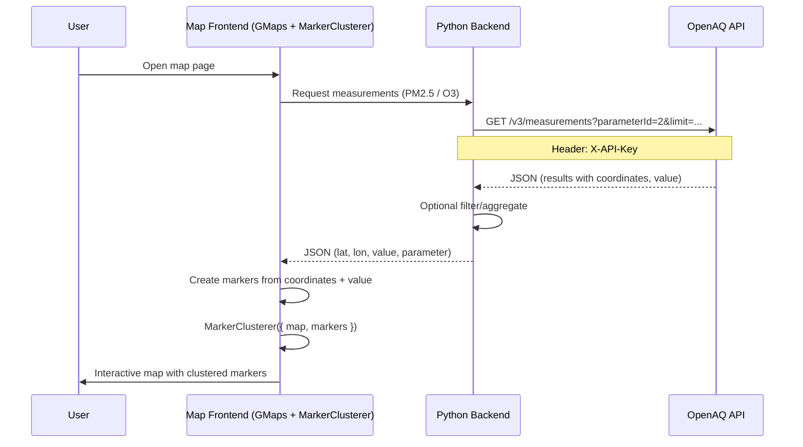

# OpenAQ and Google Maps Air Quality Map

## Overview

This project **visualizes real-time air quality data** (PM2.5 and O₃) on an **interactive map** by combining the OpenAQ API with the Google Maps JavaScript API. The backend fetches measurement data via OpenAQ; the frontend displays locations and values using Google Maps with **MarkerClusterer** for readable clustering at scale.

- Uses **Python** and **requests** to fetch current measurements from the OpenAQ **measurements** (or latest) endpoint for the relevant parameters.
- Serves or exposes that data to a **frontend** built with the **Google Maps JavaScript API**.
- Renders each measurement as a marker (or popup) and uses **MarkerClusterer** to group nearby markers by zoom level.
- Supports **PM2.5** (parameter ID 2) and **O₃** (ozone) so users can compare pollutants.

Errors (e.g. missing API keys, network failures, or invalid responses) should be handled in both backend and frontend with clear fallbacks or messages.

---

## API Details

### OpenAQ (measurements data)

| Item | Value |
|------|--------|
| **Base URL** | `https://api.openaq.org` |
| **Endpoint** | `/v3/measurements` (or `/v3/sensors/{sensors_id}/measurements` per sensor) |
| **Full URL** | `https://api.openaq.org/v3/measurements` |
| **Method** | `GET` |

#### Headers

| Header | Description |
|--------|-------------|
| `X-API-Key` | Your OpenAQ API key (required for v3). Load from environment (e.g. `OPENAQ_API_KEY`). |

#### Query Parameters

| Parameter | Type | Default | Description |
|-----------|------|---------|-------------|
| `parameterId` | integer | — | Filter by parameter (e.g. `2` = PM2.5, `7` = O₃). Use multiple requests or combined logic for both. |
| `limit` | integer | 100 | Number of results per page (max 1000). |
| `page` | integer | 1 | Page number for pagination. |
| `datetime_from` | string (ISO 8601) | — | Start of time range (recommended for measurements). |
| `datetime_to` | string (ISO 8601) | — | End of time range. |

**Alternative:** For latest readings per parameter, use `GET /v3/parameters/{parameter_id}/latest` with `limit` (and optional `page`). The backend can aggregate from either endpoint for the map.

---

### Google Maps JavaScript API and MarkerClusterer

| Item | Value |
|------|--------|
| **Maps API** | [Google Maps JavaScript API](https://developers.google.com/maps/documentation/javascript) (loaded via script or npm). |
| **MarkerClusterer** | [@googlemaps/markerclusterer](https://www.npmjs.com/package/@googlemaps/markerclusterer) (or `@googlemaps/js-markerclusterer`). |

#### Google Maps API

- **Key**: Required. Use a browser-restricted API key (e.g. HTTP referrer) in the frontend. Load from env or config (e.g. `GOOGLE_MAPS_API_KEY`).
- **Libraries**: Load the Maps JavaScript API; optionally add the MarkerClusterer script or bundle it via npm.

#### MarkerClusterer usage

- **Constructor**: `new MarkerClusterer({ map, markers })` — pass the Map instance and an array of `google.maps.Marker` (or Advanced Markers).
- **Purpose**: Groups nearby markers into clusters at different zoom levels so the map remains readable with many points.
- **Package**: `npm i @googlemaps/markerclusterer` or include via CDN (e.g. unpkg).

---

## Data Structure

### OpenAQ measurements response (representative)

The backend consumes JSON from OpenAQ. Shape varies by endpoint; below is a representative structure for measurements or latest-style results.

#### Top-level response

| Field | Type | Description |
|-------|------|-------------|
| `meta` | object | Metadata: `page`, `limit`, `found`, etc. |
| `results` | array | List of measurement objects. |

#### Each object in `results`

| Field | Type | Description |
|-------|------|-------------|
| `value` | number | Measurement value (e.g. µg/m³). |
| `parameterId` | integer | Parameter (e.g. 2 = PM2.5, 7 = O₃). |
| `datetime` | object | Timestamp of the measurement. |
| `datetime.utc` | string | ISO 8601 datetime in UTC. |
| `coordinates` | object | Optional; `latitude`, `longitude` (WGS84). |
| `locationsId` | integer | Location identifier (for map placement). |
| `sensorsId` | integer | Sensor identifier. |

#### Example response (simplified)

```json
{
  "meta": { "page": 1, "limit": 100, "found": 250 },
  "results": [
    {
      "value": 12.5,
      "parameterId": 2,
      "datetime": { "utc": "2025-02-03T14:00:00Z" },
      "coordinates": { "latitude": 40.7128, "longitude": -74.0060 },
      "locationsId": 100,
      "sensorsId": 200
    }
  ]
}
```

### Frontend map data

The frontend expects per-marker data (e.g. from your backend) with at least **latitude**, **longitude**, **value**, and **parameter** (or **parameterId**) so it can create markers and optionally color or label by pollutant (PM2.5 vs O₃).

---

## Mermaid Diagram

The following sequence diagram shows the data flow from the OpenAQ API to the map interface.



---

## Usage Instructions

### 1. Prerequisites

- **Python 3.7+** for the backend.
- **Node.js** (or a way to serve the frontend) if using npm for MarkerClusterer.
- **OpenAQ API key** — Get one from [OpenAQ](https://openaq.org/) (e.g. sign up / API access).
- **Google Maps API key** — Create one in [Google Cloud Console](https://console.cloud.google.com/) with the Maps JavaScript API enabled; restrict by HTTP referrer for the frontend.

### 2. Backend setup

Create a virtual environment and install dependencies:

```bash
python -m venv .venv
.venv\Scripts\activate
pip install requests python-dotenv
```

Add a `.env` file (do not commit it):

```env
OPENAQ_API_KEY=your_openaq_key
```

Run or expose the backend that calls the OpenAQ measurements (or latest) endpoint and returns geojson-like data (lat, lon, value, parameter) for the frontend.

### 3. Frontend setup

Install the Maps API (via script tag or npm) and MarkerClusterer:

```bash
npm i @googlemaps/markerclusterer
```

Or load MarkerClusterer via CDN:

```html
<script src="https://unpkg.com/@googlemaps/markerclusterer/dist/index.min.js"></script>
```

In your page or bundle, initialize the map with your `GOOGLE_MAPS_API_KEY`, create markers from the backend response, and pass them to `MarkerClusterer`:

```javascript
const markerCluster = new MarkerClusterer({ map, markers });
```

### 4. Run the project

Start the backend (e.g. Flask/FastAPI or static JSON export), then open or serve the frontend so it can request measurements and display the map. Adjust CORS or proxy settings if the frontend and backend are on different origins.

### 5. Expected output

You should see an interactive map with markers (or clusters) at measurement locations; each marker or cluster can show PM2.5 or O₃ values on click or hover. If the backend returns no data or an error, the frontend should show an empty state or an error message instead of failing silently.

---

## References

- [OpenAQ API Documentation](https://docs.openaq.org/)
- [OpenAQ Measurements](https://docs.openaq.org/resources/measurements)
- [Google Maps JavaScript API](https://developers.google.com/maps/documentation/javascript)
- [@googlemaps/markerclusterer (npm)](https://www.npmjs.com/package/@googlemaps/markerclusterer)
- [MarkerClusterer (Google Maps)](https://developers.google.com/maps/documentation/javascript/examples/marker-clustering)
