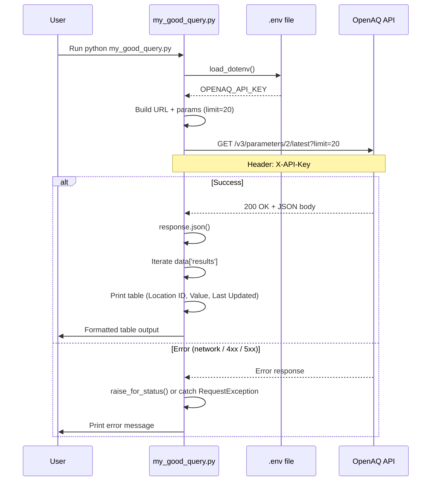
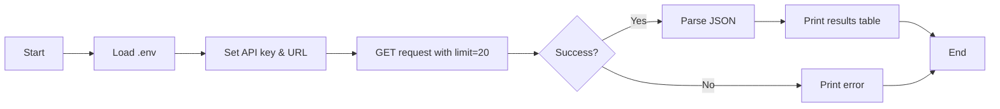

# OpenAQ Latest Measurements Query

## Overview

`my_good_query.py` fetches **latest air quality measurements** from the [OpenAQ API](https://openaq.org/) for a specific parameter (parameter ID `2`, typically PM2.5). The script:

- Calls the OpenAQ v3 **parameters latest** endpoint to get the most recent readings.
- Requests **20 results** (configurable via the `limit` parameter).
- Authenticates using an API key loaded from environment variables.
- Prints a simple table to the console with **Location ID**, **Value**, and **Last Updated (UTC)** for each measurement.

Errors (e.g., network issues or invalid API key) are caught and printed instead of crashing.

---

## API Details

| Item | Value |
|------|--------|
| **Base URL** | `https://api.openaq.org` |
| **Endpoint** | `/v3/parameters/2/latest` |
| **Full URL** | `https://api.openaq.org/v3/parameters/2/latest` |
| **Method** | `GET` |

### Headers

| Header | Description |
|--------|-------------|
| `X-API-Key` | Your OpenAQ API key (required). Loaded from the `OPENAQ_API_KEY` environment variable. |

### Query Parameters

| Parameter | Type | Default | Description |
|-----------|------|---------|-------------|
| `limit` | integer | 100 | Number of results to return. The script uses `20`. |
| `page` | integer | 1 | Page number for pagination (not used in the script). |
| `datetime_min` | string (ISO 8601) or null | — | Optional filter for minimum datetime (not used in the script). |

**Path parameter:** `2` is the parameter ID in the URL (e.g., often PM2.5 in OpenAQ).

---

## Data Structure

The API returns JSON. The script uses the following shape:

### Top-level response

| Field | Type | Description |
|-------|------|-------------|
| `meta` | object | Metadata (name, website, page, limit, found). |
| `results` | array | List of latest measurement objects. |

### Each object in `results`

| Field | Type | Description |
|-------|------|-------------|
| `locationsId` | integer | Unique location identifier. |
| `value` | number | The measurement value (e.g., µg/m³ for PM2.5). |
| `datetime` | object | Timestamp of the measurement. |
| `datetime.utc` | string | ISO 8601 datetime in UTC. |
| `datetime.local` | string | ISO 8601 datetime in local time. |
| `coordinates` | object | Optional; `latitude` and `longitude` (WGS84). |
| `sensorsId` | integer | Unique sensor identifier. |

### Example response (simplified)

```json
{
  "meta": {
    "name": "openaq-api",
    "website": "/",
    "page": 1,
    "limit": 20,
    "found": 42
  },
  "results": [
    {
      "datetime": {
        "utc": "2025-02-03T12:00:00Z",
        "local": "2025-02-03T07:00:00-05:00"
      },
      "value": 15.3,
      "coordinates": { "latitude": 40.7128, "longitude": -74.0060 },
      "sensorsId": 12345,
      "locationsId": 67890
    }
  ]
}
```

---

## Mermaid Diagram

The following sequence diagram shows how the script interacts with the OpenAQ API.



Flowchart version (high-level steps):



---

## Usage Instructions

### 1. Prerequisites

- **Python 3.7+**
- **OpenAQ API key** — Get one from [OpenAQ](https://openaq.org/) (e.g., sign up / API access).

### 2. Install dependencies

From the project root or from the `01_query_api` folder:

```bash
pip install requests python-dotenv
```

Or with a virtual environment:

```bash
python -m venv .venv
.venv\Scripts\activate   # Windows
# source .venv/bin/activate   # macOS/Linux
pip install requests python-dotenv
```

### 3. Configure the API key

Create a `.env` file in the same directory as `my_good_query.py` (or in the project root if you run the script from there and `load_dotenv()` can find it):

```env
OPENAQ_API_KEY=your_api_key_here
```

Replace `your_api_key_here` with your actual OpenAQ API key. Do not commit `.env` to version control.

### 4. Run the script

From the `01_query_api` directory:

```bash
cd 01_query_api
python my_good_query.py
```

Or from the project root if your `PYTHONPATH` or working directory is set correctly:

```bash
python 01_query_api/my_good_query.py
```

### 5. Expected output

You should see a table like:

```
Location ID  | Value      | Last Updated
--------------------------------------------------
67890        | 15.3       | 2025-02-03T12:00:00Z
67891        | 22.1       | 2025-02-03T11:55:00Z
...
```

If there are no results or an error occurs, you will see `No data found for this query.` or an error message instead.

---

## References

- [OpenAQ API Documentation](https://docs.openaq.org/)
- [Parameters Latest (v3) – GET](https://docs.openaq.org/api/operations/parameters_latest_get_v3_parameters__parameters_id__latest_get)
